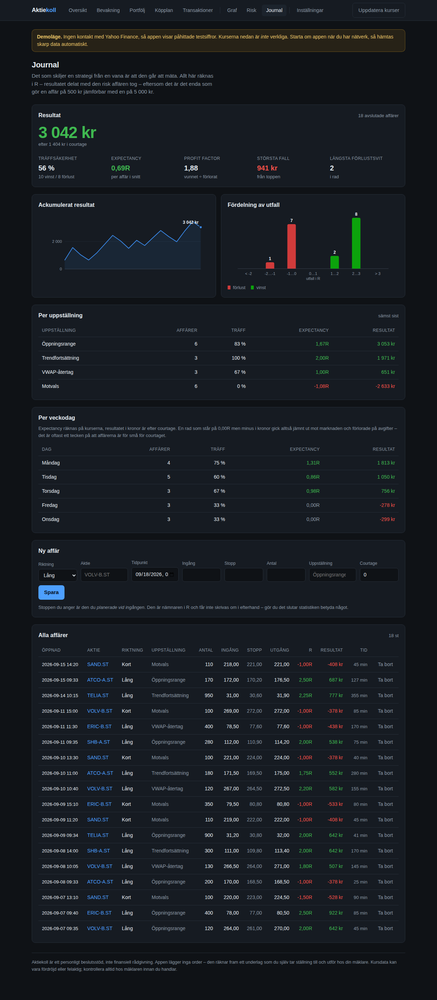

# Aktiekoll

Personligt beslutsstöd för aktier, i två delar som delar samma kodbas:

- **Långsiktigt** – vad är värt att köpa enligt dina egna regler, till vilket pris, och
  hur mycket räcker månadens budget till.
- **Daytrading** – hur stor får positionen vara givet din risk, och tjänar dina
  uppställningar faktiskt pengar när man räknar efter.

Appen lägger inga order. Den räknar fram underlag som du själv tar ställning till och
utför hos din mäklare.




## Vad den gör

**Bevakningslista med köpgräns.** Du sätter i förväg det pris du är beredd att betala för
varje bolag. Appen visar när kursen är under gränsen. Det gör köpbeslutet till en regel du
fattade när du var lugn, istället för en impuls när kursen rör sig.

**Checklista per aktie.** Varje bolag prövas mot dina kriterier – lägsta direktavkastning,
högsta P/E, hållbar utdelningsandel, och om posten redan är för stor i portföljen. Du ser
vilka krav som är uppfyllda och vilka som inte är det, inte bara ett omdöme.

**Portfölj enligt genomsnittsmetoden.** GAV räknas fram ur dina transaktioner med
courtage inräknat, och påverkas inte av försäljningar. Realiserat resultat och mottagna
utdelningar bokförs separat, så att totalavkastningen blir rätt.

**Köpplan.** Du anger en budget. Appen fördelar den på de bevakade aktier som ligger längst
under sin önskade portföljandel och samtidigt handlas under din köpgräns – i hela aktier,
med courtaget inräknat, och med en spärr mot order så små att avgiften äter upp dem.
Resultatet finns även som ren textlista på `/plan.txt` att ha bredvid mäklaren.

## Daytrading-delen

**Riskberäknare** (`/risk`). Du anger ingång och stopp; appen räknar fram antalet aktier
ur kontostorlek × risk per affär ÷ avståndet till stoppen. Courtaget in och ut ligger i
den redovisade risken, målkurserna anges i R, och stoppen jämförs mot ATR så att du får
en varning när den ligger innanför aktiens normala brus.

**Handelsjournal** (`/journal`). Varje affär loggas med den stopp du planerade vid
ingången – det är nämnaren i R, och den får inte skrivas om i efterhand. Statistiken ger
träffsäkerhet, expectancy, profit factor, största fall från toppen och längsta
förlustsvit, uppdelat per uppställning och veckodag. Det är den uppdelningen som är
poängen: nästan alla som går back gör det på en eller två uppställningar medan resten går
plus.

**Intradagsgraf** (`/trading`). Staplar med VWAP, EMA och dagens öppningsrange, samt ATR
och RSI. Stigande staplar ritas ihåliga och fallande fyllda, så att riktningen syns på
formen och inte bara på färgen.

### Om fördröjningen – läs den här biten

Yahoo levererar de flesta börser med **cirka 15 minuters fördröjning**. Det gör grafen
användbar för att studera och utvärdera, men **oanvändbar som beslutsunderlag i realtid**.
Appen skriver ut fördröjningen vid varje graf av just det skälet. Ska du fatta beslut
sekund för sekund behöver du en betald realtidsfeed; din mäklares egen app är det närmaste
till hands. Riskberäknaren och journalen berörs inte alls – de behöver ingen realtidsdata.

## Kom igång

```bash
./run.sh                    # skapar virtuell miljö vid behov och startar på :8000
```

Öppna http://127.0.0.1:8000. Vill du ha exempeldata att titta på:

```bash
.venv/bin/python -m app.seed
```

## Kursdata

Hämtas från Yahoo Finance via `yfinance` – gratis och utan API-nyckel. Stockholmsbörsen
skrivs med ändelsen `.ST`, till exempel `VOLV-B.ST`. Amerikanska bolag skrivs som vanligt,
`AAPL`. Belopp i främmande valuta växlas till kronor med dagsaktuell kurs.

Går nätet inte fram startar appen ändå, i **demoläge** med påhittade testsiffror och en
tydlig varning högst upp. Tvinga fram det läget med `AKTIEKOLL_SOURCE=demo`, eller kräv
skarp data med `AKTIEKOLL_SOURCE=yahoo`. Svar cachas i femton minuter.

## Så räknas det

| Händelse | Effekt |
|---|---|
| Köp | Omkostnadsbeloppet ökar med köpeskilling **och** courtage; GAV vägs om |
| Sälj | GAV är oförändrat, antalet minskar, mellanskillnaden bokas som realiserat |
| Utdelning | Bokas separat, rör inte GAV; lämna antal tomt för hela innehavet |
| Split | Samma omkostnadsbelopp fördelas på fler aktier, GAV skalas ned |

För daytrading gäller andra tal. **R** är resultatet delat med den risk affären tog: en
affär som gav två gånger avståndet till stoppen är +2R, oavsett om det var 500 eller
5 000 kr. R räknas på kurserna, kronorna är efter courtage – går en uppställning på 0,00R
men minus i kronor betyder det att den går jämnt ut mot marknaden och förlorar på
avgifter. **Expectancy** är snittutfallet i R; under noll kostar strategin pengar per
affär, och fler affärer gör det värre. Positionstaket för intradag är avsiktligt skilt
från långsiktstaket: intradag begränsas av risken, inte av exponeringen.

Köpplanen räknar målvikt mot portföljvärdet *efter* insättningen, kapar varje målvikt mot
ditt tak för enskilda innehav, och köper aldrig fler aktier än budgeten rymmer inklusive
courtage.

## Testerna

```bash
.venv/bin/python -m pytest tests -q
```

90 tester. Tyngdpunkten ligger på beräkningarna – genomsnittsmetoden, planerarens
budgethållning, positionsstorleken, R-statistiken och indikatorerna – eftersom det är där
ett fel kostar pengar.

## Struktur

```
app/
  main.py              vyer och formulär
  db.py                SQLite-schema och inställningar
  format.py            svensk sifferformatering
  charts.py            grafer som serverritad SVG, utan byggsteg
  market/              kursdata: base (gränssnitt), yahoo (skarp), demo (offline)
    intraday.py        OHLCV-staplar med kort cache
  services/
    holdings.py        genomsnittsmetoden – appens kärna
    analysis.py        checklistan mot dina regler
    planner.py         budget → orderunderlag
    overview.py        sammanställningen som vyerna delar
    risk.py            positionsstorlek ur risk
    journal.py         R-statistik för handelsjournalen
    indicators.py      EMA, VWAP, RSI, ATR, öppningsrange
tests/
```

Databasen ligger i `data/aktiekoll.db`. Flytta den med `AKTIEKOLL_DB`.

## Vad den medvetet inte gör

Appen kopplar inte upp sig mot din mäklare och kan inte handla åt dig. Avanza och Nordnet
har inga officiellt öppna API:er. Vill du automatisera själva orderläggningen är
Interactive Brokers eller Alpaca vägen framåt – marknadsdatalagret är redan avgränsat
bakom `app/market/base.py`, så en orderkoppling kan läggas till utan att röra resten.

En sista sak om daytrading specifikt: Finansinspektionens och ESMA:s återkommande
granskningar visar att en stor majoritet av privatpersoner som handlar aktivt går back.
Den här appen är byggd mot disciplin och uppföljning snarare än mot fler köpsignaler,
just därför – men inget verktyg kan göra en förlustbringande strategi lönsam. Journalen
kan däremot visa dig att den är det, vilket är den mest användbara uppgift den kan ge.

Appen ger inte heller råd. Den känner inte till din ekonomi i övrigt, din tidshorisont
eller din risktolerans, och kurs- och nyckeltalsdata från Yahoo kan vara fördröjd eller
direkt felaktig. Kontrollera alltid hos mäklaren innan du handlar.
