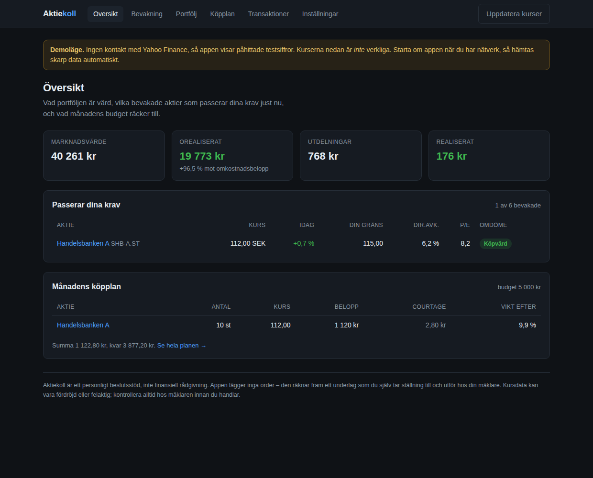

# Aktiekoll

Personligt beslutsstöd inför aktieköp. Appen svarar på tre frågor: **vad** är värt att
köpa enligt dina egna regler, **till vilket pris**, och **hur mycket** räcker månadens
budget till.

Den lägger inga order. Den räknar fram ett underlag som du själv tar ställning till och
utför hos din mäklare.



## Vad den gör

**Bevakningslista med köpgräns.** Du sätter i förväg det pris du är beredd att betala för
varje bolag. Appen visar när kursen är under gränsen. Det gör köpbeslutet till en regel du
fattade när du var lugn, istället för en impuls när kursen rör sig.

**Checklista per aktie.** Varje bolag prövas mot dina kriterier – lägsta direktavkastning,
högsta P/E, hållbar utdelningsandel, och om posten redan är för stor i portföljen. Du ser
vilka krav som är uppfyllda och vilka som inte är det, inte bara ett omdöme.

**Portfölj enligt genomsnittsmetoden.** GAV räknas fram ur dina transaktioner med
courtage inräknat, och påverkas inte av försäljningar. Realiserat resultat och mottagna
utdelningar bokförs separat, så att totalavkastningen blir rätt.

**Köpplan.** Du anger en budget. Appen fördelar den på de bevakade aktier som ligger längst
under sin önskade portföljandel och samtidigt handlas under din köpgräns – i hela aktier,
med courtaget inräknat, och med en spärr mot order så små att avgiften äter upp dem.
Resultatet finns även som ren textlista på `/plan.txt` att ha bredvid mäklaren.

## Kom igång

```bash
./run.sh                    # skapar virtuell miljö vid behov och startar på :8000
```

Öppna http://127.0.0.1:8000. Vill du ha exempeldata att titta på:

```bash
.venv/bin/python -m app.seed
```

## Kursdata

Hämtas från Yahoo Finance via `yfinance` – gratis och utan API-nyckel. Stockholmsbörsen
skrivs med ändelsen `.ST`, till exempel `VOLV-B.ST`. Amerikanska bolag skrivs som vanligt,
`AAPL`. Belopp i främmande valuta växlas till kronor med dagsaktuell kurs.

Går nätet inte fram startar appen ändå, i **demoläge** med påhittade testsiffror och en
tydlig varning högst upp. Tvinga fram det läget med `AKTIEKOLL_SOURCE=demo`, eller kräv
skarp data med `AKTIEKOLL_SOURCE=yahoo`. Svar cachas i femton minuter.

## Så räknas det

| Händelse | Effekt |
|---|---|
| Köp | Omkostnadsbeloppet ökar med köpeskilling **och** courtage; GAV vägs om |
| Sälj | GAV är oförändrat, antalet minskar, mellanskillnaden bokas som realiserat |
| Utdelning | Bokas separat, rör inte GAV; lämna antal tomt för hela innehavet |
| Split | Samma omkostnadsbelopp fördelas på fler aktier, GAV skalas ned |

Köpplanen räknar målvikt mot portföljvärdet *efter* insättningen, kapar varje målvikt mot
ditt tak för enskilda innehav, och köper aldrig fler aktier än budgeten rymmer inklusive
courtage.

## Testerna

```bash
.venv/bin/python -m pytest tests -q
```

42 tester. Tyngdpunkten ligger på beräkningarna – genomsnittsmetoden, planerarens
budgethållning och checklistans regler – eftersom det är där ett fel kostar pengar.

## Struktur

```
app/
  main.py              vyer och formulär
  db.py                SQLite-schema och inställningar
  format.py            svensk sifferformatering
  market/              kursdata: base (gränssnitt), yahoo (skarp), demo (offline)
  services/
    holdings.py        genomsnittsmetoden – appens kärna
    analysis.py        checklistan mot dina regler
    planner.py         budget → orderunderlag
    overview.py        sammanställningen som vyerna delar
tests/
```

Databasen ligger i `data/aktiekoll.db`. Flytta den med `AKTIEKOLL_DB`.

## Vad den medvetet inte gör

Appen kopplar inte upp sig mot din mäklare och kan inte handla åt dig. Avanza och Nordnet
har inga officiellt öppna API:er. Vill du automatisera själva orderläggningen är
Interactive Brokers eller Alpaca vägen framåt – marknadsdatalagret är redan avgränsat
bakom `app/market/base.py`, så en orderkoppling kan läggas till utan att röra resten.

Appen ger inte heller råd. Den känner inte till din ekonomi i övrigt, din tidshorisont
eller din risktolerans, och kurs- och nyckeltalsdata från Yahoo kan vara fördröjd eller
direkt felaktig. Kontrollera alltid hos mäklaren innan du handlar.
